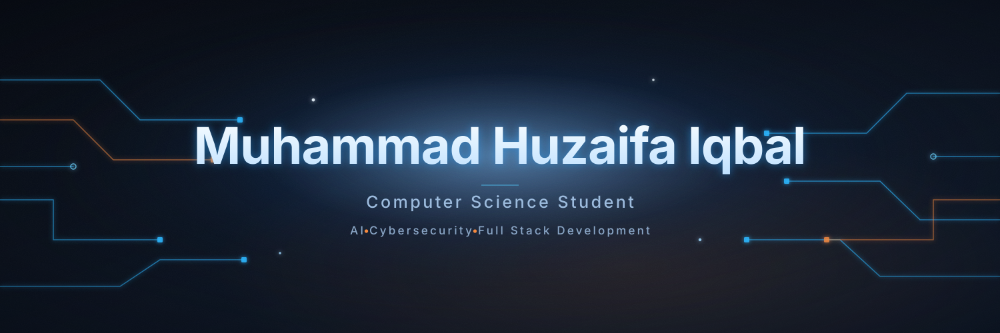

  

<picture>
  <source media="(prefers-color-scheme: dark)" srcset="https://raw.githubusercontent.com/Mhuzaifaiqbal/Mhuzaifaiqbal/output/github-contribution-grid-snake-dark.svg">
  <source media="(prefers-color-scheme: light)" srcset="https://raw.githubusercontent.com/Mhuzaifaiqbal/Mhuzaifaiqbal/output/github-contribution-grid-snake.svg">
  
</picture>
--> 
  
 
 🎓&nbsp; CS @ LUMS &nbsp;·&nbsp; 📍&nbsp; Lahore, Pakistan &nbsp;·&nbsp; 🌐&nbsp; Open to internships &amp; collaboration     
   <!-- ============================================================= --> <!-- 01 · ABOUT --> <!-- ============================================================= -->
01 · 👋   About Me

I'm Huzaifa — a Computer Science student at LUMS working at the intersection of backend systems, computer networks, and applied AI. 🧠

🔭  I like problems that go deep — designing secure APIs, defending networks against real attacks, and wiring language models into genuinely useful tools.
💼  On the freelance side, I've shipped production web apps for clients, including a secure government data-management portal for a public-sector client.
🧩  I learn from first principles — the kind of person who builds a web browser from scratch just to understand how the web really works.
⚡  Currently exploring LLM agents and secure backend architecture.
  <!-- ============================================================= --> <!-- 02 · FOCUS --> <!-- ============================================================= -->
02 · 🧭   Fields I Work In
	Focus Area	What that looks like
🔧	Backend & API Engineering	Clean, secure APIs — FastAPI, REST, JWT / bcrypt auth
🛰️	Networking	SDN, intrusion detection & prevention, packet analysis
🔐	Cybersecurity	ARP-spoof / MITM & DoS defense, secure system design
🧠	AI / ML Engineering	LLM integration & agents, classical ML modelling
🖥️	Full-Stack Development	End-to-end web apps with typed front-ends
🧪	Systems & Fundamentals	Learning by building things from the ground up
  <!-- ============================================================= --> <!-- 03 · TOOLBOX --> <!-- ============================================================= -->
03 · 🧰   Toolbox

  

🧠 AI / ML  ·  scikit-learn · pandas · LangChain · LLM integration (Ollama / Llama 3)

🛰️ Networking & Security  ·  Wireshark · SDN (OpenFlow / POX) · IDS / IPS · REST · JWT · bcrypt

⚙️ Backend & Data  ·  FastAPI · Supabase · SQL · Docker · Git

  <!-- ============================================================= --> <!-- 04 · CERTIFICATIONS --> <!-- ============================================================= -->
04 · 📜   Certifications
🎓  Supervised Machine Learning — Stanford University · verify
🐍  Python for Data Science & AI — IBM · verify
🎨  Frontend Development — OneRoadmap · verify
  <!-- ============================================================= --> <!-- 05 · STATS (animated) --> <!-- ============================================================= -->
05 · 📊   GitHub in Numbers

   
 
  
   <!-- ============================================================= --> <!-- 06 · CONNECT --> <!-- ============================================================= -->
06 · 🤝   Let's Connect

     
 
   Designed to match the banner — deep navy, quiet blue, lots of whitespace. 
 <!-
